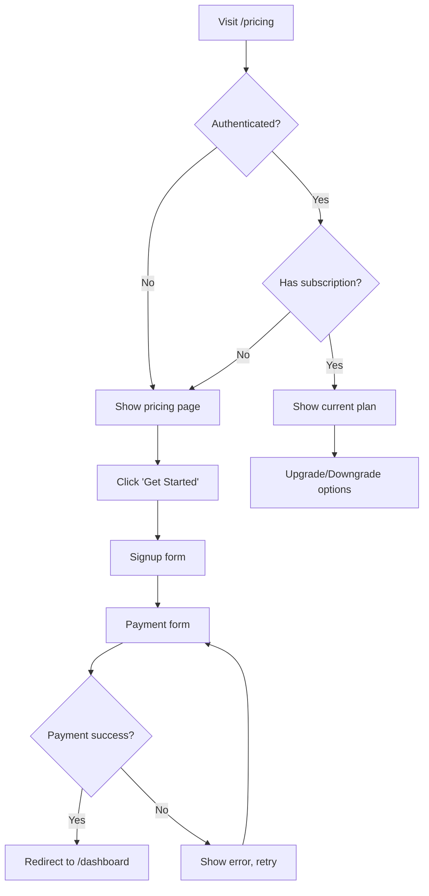
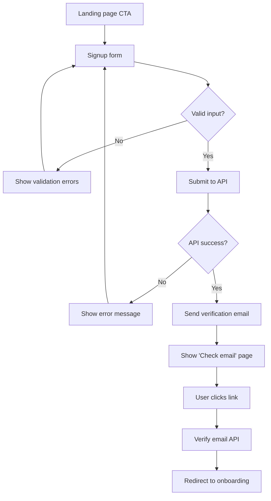
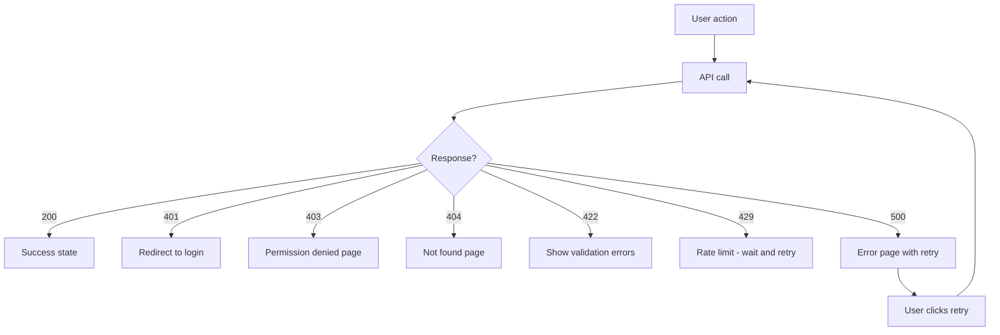

# ux-flow

## Description

Map user experience flows through the product. Define entry points, navigation paths, user actions, system feedback, and outcome states. Create visual flow diagrams that guide frontend implementation.

## When to Trigger

- Planning a new feature's user journey
- Designing navigation structure
- Onboarding flow design
- Multi-step processes (checkout, signup, settings wizards)
- User says "user flow", "journey", "navigation", "onboarding", "wizard"

## Instructions

### Flow Mapping Framework

For every user flow, document:

```
1. ENTRY POINTS — How does the user arrive?
   - Direct URL / bookmark
   - Navigation menu
   - CTA from another page
   - Email link / notification
   - Deep link / shared URL

2. SCREENS — What does the user see?
   - Page/component name
   - Key content and actions
   - Layout reference (Stitch/Pencil design)

3. ACTIONS — What can the user do?
   - Primary action (main CTA)
   - Secondary actions (links, buttons)
   - Destructive actions (delete, cancel)

4. FEEDBACK — What happens after action?
   - Loading states
   - Success messages / redirects
   - Error messages with recovery paths
   - Optimistic updates

5. OUTCOMES — Where does the user end up?
   - Success state
   - Error state with retry
   - Partial completion with resume
```

### Mermaid Diagrams

Use Mermaid for visual flow documentation:



### Navigation Structure

Document the app's navigation hierarchy:

```
Public:
  /              → Landing page
  /pricing       → Pricing page
  /login         → Login
  /signup        → Signup
  /blog          → Blog listing

Authenticated:
  /dashboard     → Main dashboard
  /settings      → Settings
    /settings/profile    → Profile settings
    /settings/billing    → Billing settings
    /settings/security   → Security settings
  /projects      → Project listing
    /projects/[id]       → Project detail
    /projects/[id]/edit  → Project editor
```

### Error States to Always Document

For every flow, define these error states:

```
1. Network failure — API unreachable
2. Auth expired — Session timeout mid-flow
3. Validation error — Invalid input
4. Permission denied — Unauthorized action
5. Resource not found — 404 / deleted item
6. Rate limited — Too many requests
7. Payment failed — Card declined / payment error
8. Concurrent edit — Another user modified same resource
```

### Edge Cases Checklist

- [ ] What happens on slow connections?
- [ ] What if the user refreshes mid-flow?
- [ ] What if they use the back button?
- [ ] What if they open multiple tabs?
- [ ] What if the API returns unexpected data?
- [ ] What if they lose internet mid-action?
- [ ] What if they're on mobile vs desktop?

## Examples

### Example 1: Signup Flow



**Screens needed:** Landing, Signup form, Check email, Onboarding
**Error states:** Validation, API failure, Email already exists, Verification expired

### Example 2: Settings Update Flow

```mermaid
flowchart TD
    A[/settings/profile] --> B[Load user data]
    B --> C[Show form with current values]
    C --> D[User edits fields]
    D --> E{Dirty form?}
    E -->|Yes| F[Show 'Save' button]
    F --> G[Click Save]
    G --> H{Valid?}
    H -->|No| I[Show inline errors]
    H -->|Yes| J[Submit to API]
    J --> K{Success?}
    K -->|Yes| L[Show success toast]
    K -->|No| M[Show error, preserve form]
    E -->|No| N[Button disabled]
```

### Example 3: Error Recovery Flow



## Anti-Patterns

- **Don't skip error states.** Every flow needs error handling documented. "It just works" is not a flow.
- **Don't assume the user knows the flow.** Document every step. What's obvious to you is confusing to a new user.
- **Don't create dead ends.** Every screen needs an exit path. Users should never be stuck.
- **Don't forget loading states.** Every API call needs a loading indicator. Users think the app is broken without feedback.
- **Don't skip the back button.** Users will press back. Define what happens.
- **Don't design only for the happy path.** The happy path is 30% of real usage. Error and edge cases are the majority.
- **Don't create flows without entry points.** If users can't find it, it doesn't exist.
- **Don't forget mobile navigation.** Desktop nav patterns don't translate directly to mobile.
