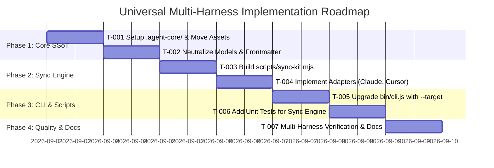

# Implementation Plan: Universal Multi-Harness Architecture

> **Status**: In Review (Draft)  
> **Author**: Tech Lead Agent  
> **Created**: 2026-09-03  
> **Version**: 1.3.0  
> **Roadmap Item**: [README.md § v3.0 Multi-harness Support](../../README.md#v30-future)  
> **Target Platforms**: OpenCode, Claude Code, Antigravity, Cursor, Windsurf, Roo Code / Cline  

---

## 1. Summary

Dự án hiện tại hoạt động mạnh mẽ trên OpenCode (`.opencode/`), nhưng bị gắn chặt vào cấu trúc runtime của OpenCode. Mục tiêu của kế hoạch này là nâng cấp bộ kit thành **Universal Multi-Harness Architecture** bằng cách tách toàn bộ giá trị cốt lõi (11 chuyên gia AI, 157+ skills, coding standards, quy trình TDD, AgentShield security gate) vào **Single Source of Truth (`.agent-core/`)**.

Thông qua một bộ **Universal Sync Engine** (`scripts/sync-kit.mjs`) và CLI mở rộng, bộ kit sẽ đồng bộ tự động hoặc tạo symlink cho mọi môi trường AI developer phổ biến hiện nay:
1. **OpenCode**: Thư mục `.opencode/` + `opencode.json` (Backward compatible 100%).
2. **Claude Code**: Thư mục `.claude/skills/` + `CLAUDE.md`.
3. **Antigravity**: Thư mục `.agents/skills/`, `.agents/rules/` + `AGENTS.md`.
4. **Cursor & Windsurf**: Thư mục `.cursor/rules/*.mdc` (domain-scoped globs) + `.cursorrules`.
5. **Roo Code / Cline**: Thư mục `.clinerules` / `.roomodes`.

**Nguyên tắc bất di bất dịch (Zero Regression):**
- Giữ vững 100% các bài test hiện hành (`npm test`, `npm run verify`, `npm run verify:cli`).
- Không sao chép trùng lặp dữ liệu (sử dụng relative symlink thông minh, fallback copy nếu môi trường không hỗ trợ).

---

## 2. Implementation Phases & Tasks

### Phase 1: Establish Single Source of Truth (`.agent-core/`)

**Mục tiêu**: Tách biệt toàn bộ nội dung nghiệp vụ SaaS ra khỏi nền tảng OpenCode, thiết lập `.agent-core/` làm trung tâm lưu trữ duy nhất.

| Task ID | Tên công việc | Chi tiết kỹ thuật | Tiêu chí hoàn thành |
|---|---|---|---|
| **T-001** | Tạo cấu trúc thư mục `.agent-core/` | Di chuyển/tổ chức lại: `.agent-core/agents/` (11 agents), `.agent-core/skills/` (157 skills), `.agent-core/rules/`, `.agent-core/standards/`, `.agent-core/templates/`. | Cấu trúc `.agent-core/` sẵn sàng, không mất file nào. |
| **T-002** | Đồng bộ Model từ `agent-models.json` (SSoT) | Giữ `agent-models.json` làm Single Source of Truth duy nhất cho models. Khi người dùng thay đổi model trong file này, lệnh sync sẽ tự động cập nhật trường `model:` trong frontmatter của 11 agents và đồng bộ toàn bộ hệ thống. | `agent-models.json` là nguồn duy nhất, sync tự động cập nhật frontmatter của 11 agents. |
| **T-003** | Chuẩn hóa `## Startup (AUTO-EXECUTE)` | Cập nhật đoạn khởi động trong 11 agent để tự động phát hiện runtime (OpenCode, Claude, Antigravity) mà không gây lỗi khi thiếu lệnh `skill()`. | 11 agent đều chứa startup block tương thích đa nền tảng. |

---

### Phase 2: Universal Sync Engine (`scripts/sync-kit.mjs`)

**Mục tiêu**: Viết bộ sinh/đồng bộ cấu hình đa nền tảng tự động, sử dụng symlink tương đối (relative symlinks).

| Task ID | Tên công việc | Chi tiết kỹ thuật | Tiêu chí hoàn thành |
|---|---|---|---|
| **T-004** | Xây dựng engine `scripts/sync-kit.mjs` | Tạo script nhận tham số `--target [all|opencode|claude|cursor|antigravity]` và flag `--copy` (nếu OS không hỗ trợ symlinks). | Script chạy thành công với Node.js thuần, không cần thêm external dependency. |
| **T-005** | Adapter OpenCode (`.opencode/`) | Tạo symlink từ `.opencode/agents`, `.opencode/skills`, `.opencode/rules`, `.opencode/standards` trỏ về `.agent-core/`. Đồng bộ `opencode.json`. | Toàn bộ lệnh `npm run verify` của OpenCode pass 120/120 checks. |
| **T-006** | Adapter Antigravity (`.agents/`) | Tạo symlink `.agents/skills` và `.agents/rules` trỏ về `.agent-core/`. Đảm bảo `AGENTS.md` ở root hoạt động tối ưu. | Antigravity tự động phát hiện đầy đủ 157 skills và các rules. |
| **T-007** | Adapter Claude Code (`.claude/` & `CLAUDE.md`) | Tạo symlink `.claude/skills` trỏ về `.agent-core/skills/`. Tạo file `CLAUDE.md` tại root (chứa con trỏ và quy tắc dự án tương đương `AGENTS.md`). | Claude Code đọc được skills và tuân thủ các quy tắc cốt lõi. |
| **T-008** | Adapter Cursor (`.cursor/rules/*.mdc`) | Chuyển đổi các agent boundaries thành các file rule `.mdc` có gắn `globs` scoped: - `frontend.mdc` -> `globs: "apps/web/**/*"` - `nestjs.mdc` -> `globs: "apps/api/**/*"` - `rustacean.mdc` -> `globs: "apps/desktop/**/*,crates/**/*"` - `devops.mdc` -> `globs: ".github/**/*,Dockerfile,docker-compose*,infra/**/*"` | Cursor Composer tự động kích hoạt đúng rule khi mở file trong thư mục tương ứng. |

---

### Phase 3: Nâng cấp CLI & Bộ Test tự động

**Mục tiêu**: Tích hợp các khả năng mới vào CLI `opencode-saas-kit` và viết test kiểm thử tự động.

| Task ID | Tên công việc | Chi tiết kỹ thuật | Tiêu chí hoàn thành |
|---|---|---|---|
| **T-009** | Cập nhật `bin/cli.js` | Bổ sung subcommand `sync` và flag `--target` cho lệnh `init`: `npx opencode-saas-kit init --target [target]`. | CLI chạy mượt mà, thông báo rõ ràng từng target được đồng bộ. |
| **T-010** | Viết Unit Test `scripts/__tests__/sync-kit.test.mjs` | Test kiểm tra tính hợp lệ của symlinks, sự toàn vẹn của các file generated (`.mdc`, `CLAUDE.md`, `AGENTS.md`). | `npm test` bao gồm cả bộ test mới và đạt 100% pass. |
| **T-011** | Cập nhật `npm run verify` & `verify:cli` | Bổ sung kiểm tra liên kết của `.agent-core/` trong khi vẫn bảo toàn đầy đủ các verify checks của OpenCode. | `npm run test:all` chạy qua tất cả các tầng kiểm tra. |

---

### Phase 4: Bảo mật & Tài liệu hóa

**Mục tiêu**: Đảm bảo an toàn bảo mật và cập nhật tài liệu chính thức.

| Task ID | Tên công việc | Chi tiết kỹ thuật | Tiêu chí hoàn thành |
|---|---|---|---|
| **T-012** | Universal AgentShield Gating | Đảm bảo `security-gate.mjs` có thể chạy độc lập qua npm script `npm run security:gate` và trong Git Pre-commit hook để bảo vệ repo bất kể dùng tool nào. | Security gate chặn thành công leak secrets và vi phạm bảo mật trên mọi nền tảng. |
| **T-013** | Cập nhật `README.md` & `CHANGELOG` | Đưa tính năng Multi-Harness từ mục Roadmap v3.0 lên mục tính năng chính thức của v1.3.0. Bổ sung hướng dẫn sử dụng cho Cursor, Claude Code, Antigravity. | Tài liệu rõ ràng, chuẩn mực. |

---

## 3. Ma trận tương thích các nền tảng (Compatibility Matrix)

| Nền tảng AI | Thư mục cấu hình | File chỉ dẫn / Entry Point | Cơ chế Skills | Phạm vi Agent (Agent Scoping) |
|---|---|---|---|---|
| **OpenCode** | `.opencode/` | `AGENTS.md` + `opencode.json` | Built-in `skill()` | Slash commands (`/plan`, `/build`, etc.) & Subagents |
| **Claude Code** | `.claude/` | `CLAUDE.md` | `.claude/skills/` | Prompts / Task tool & Slash commands |
| **Antigravity** | `.agents/` | `AGENTS.md` | `.agents/skills/` & `.agents/rules/` | Context-aware Agent triggering |
| **Cursor** | `.cursor/rules/` | `.cursorrules` + `.mdc` files | Scoped references trong rules | Tự động áp dụng theo file globs (`apps/web/`, `apps/api/`, etc.) |
| **Windsurf / Cascade** | `.codeium/` | `.windsurfrules` | System prompt references | Scoped rules |

---

## 4. Quản trị rủi ro & Kế hoạch Rollback

| Rủi ro tiềm ẩn | Mức độ | Biện pháp giảm thiểu |
|---|---|---|
| **Lỗi Symlink trên Windows** | Trung bình | `sync-kit.mjs` có cờ kiểm tra OS; nếu symlink bị từ chối quyền (permission denied), tự động fallback sang cơ chế copy trực tiếp. |
| **Lỗi các test OpenCode hiện tại** | Cao | Thư mục `.opencode/` vẫn được duy trì đầy đủ (thông qua symlink hoặc SSoT sync) để mọi đường dẫn cũ không bị vỡ. |
| **Trùng lặp Git diff nếu dùng copy** | Thấp | Thêm các thư mục phái sinh vào `.gitignore` nếu người dùng chạy ở chế độ copy thay vì symlink. |

**Kế hoạch Rollback:**
- Toàn bộ quá trình được commit theo từng bước nhỏ độc lập (`feat(core)`, `feat(sync)`, `feat(cli)`).
- Nếu phát sinh lỗi không mong muốn, có thể checkout lại commit gốc `72db913` chỉ trong 1 lệnh git.

---

## 5. Definition of Done (DoD)

- [ ] Toàn bộ 11 agents và 157 skills được tổ chức chuẩn trong `.agent-core/`.
- [ ] `node scripts/sync-kit.mjs` chạy không lỗi, hỗ trợ đủ 4 nền tảng (OpenCode, Claude Code, Antigravity, Cursor).
- [ ] Tất cả 58 unit tests hiện có + test mới của `sync-kit` đều **PASS**.
- [ ] Lệnh `npm run verify` và `npm run verify:cli` đạt **120/120 checks PASS**.
- [ ] Bộ lọc bảo mật AgentShield hoạt động trơn tru.
- [ ] Tài liệu `README.md` cập nhật đầy đủ hướng dẫn sử dụng Multi-Harness.
